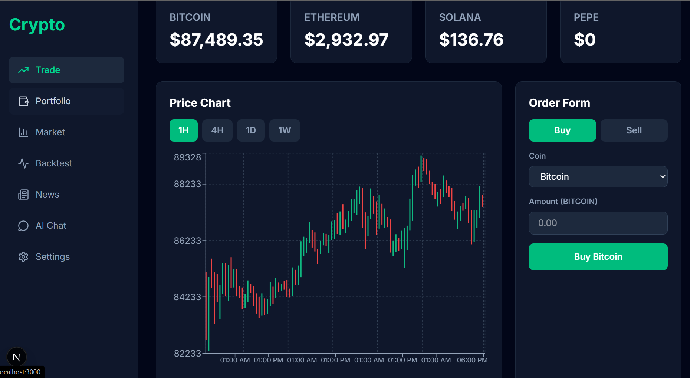
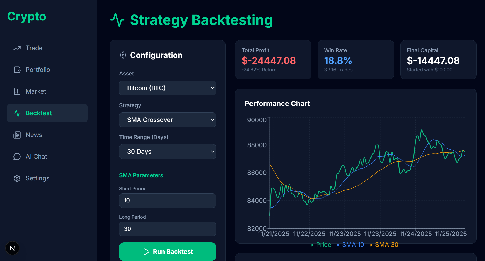
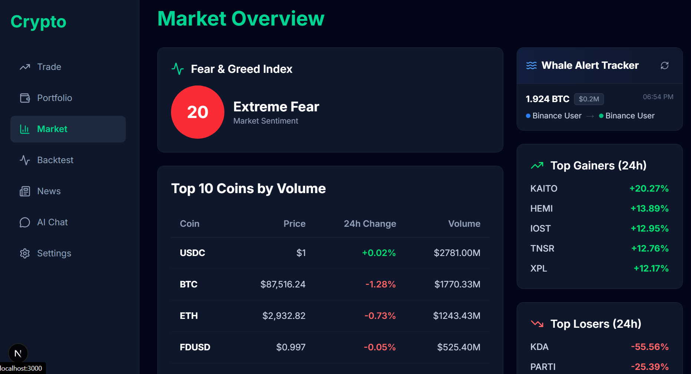

# 🚀 Crypto Trading Platform

A full-stack cryptocurrency trading platform with AI-powered insights, real-time market data, strategy backtesting, and paper trading capabilities.


## ✨ Features

### 📊 Trading & Analytics
- **Live Price Charts** - Real-time candlestick charts with multiple timeframes (1H, 4H, 1D, 1W)
- **Paper Trading** - Practice trading with virtual money
- **Portfolio Tracking** - Monitor holdings, profits, and performance metrics
- **What-If Calculator** - Simulate potential profits from past investments

### 🤖 AI & Intelligence
- **AI Chat Assistant** - Powered by Google Gemini AI for crypto insights and education
- **Strategy Backtesting** - Test SMA Crossover and RSI strategies on historical data
- **Whale Alert Tracker** - Monitor large crypto transactions in real-time (>$50K)

### 📈 Market Data
- **Fear & Greed Index** - Track market sentiment
- **Top Gainers/Losers** - 24-hour market movers
- **Crypto News** - Latest news with sentiment analysis
- **Price Alerts** - Set custom price notifications

## 🛠️ Tech Stack

### Frontend
- **Next.js 14** - React framework with App Router
- **TypeScript** - Type-safe development
- **Recharts** - Interactive data visualization
- **Tailwind CSS** - Modern styling
- **Axios** - HTTP client

### Backend
- **FastAPI** - High-performance Python API framework
- **Python 3.11+** - Core backend language
- **Pandas & NumPy** - Data analysis and calculations
- **Google Gemini AI** - AI chat capabilities

### Data Sources
- **Binance API** - Real-time crypto prices and trades
- **CoinGecko API** - Market data and coin information
- **Alternative.me** - Fear & Greed Index

## 🚀 Getting Started

### Prerequisites
- Python 3.11 or higher
- Node.js 18 or higher
- npm or yarn

### Installation

1. **Clone the repository**
```bash
git clone https://github.com/yourusername/crypto-trading-platform.git
cd crypto-trading-platform
```

2. **Set up the backend**
```bash
cd backend
python -m venv venv
venv\Scripts\activate  # On Windows
# source venv/bin/activate  # On macOS/Linux
pip install -r requirements.txt
```

3. **Set up the frontend**
```bash
cd frontend
npm install
```

4. **Configure environment variables**

Create a `.env` file in the `backend` directory:
```env
GEMINI_API_KEY=your_gemini_api_key_here
```

Get your free Gemini API key from: https://aistudio.google.com/app/apikey

### Running the Application

**Terminal 1 - Backend:**
```bash
cd backend
python main.py
```
Backend runs on: http://localhost:8000

**Terminal 2 - Frontend:**
```bash
cd frontend
npm run dev
```
Frontend runs on: http://localhost:3000

## 📸 Screenshots

### Trading Dashboard


### Strategy Backtesting


### Market Overview


## 🎯 Key Features Explained

### Strategy Backtesting
Test your trading strategies on historical data:
- **SMA Crossover**: Buy when short MA crosses above long MA
- **RSI Strategy**: Buy when RSI < 30 (oversold), sell when RSI > 70 (overbought)
- View detailed metrics: Win rate, total profit, trade log

### Whale Alert Tracker
Monitor significant market movements:
- Tracks trades over $50,000 USD
- Real-time updates from Binance
- Shows BTC, ETH, SOL, BNB, and XRP

### AI Chat Assistant
Get instant crypto insights:
- Powered by Google Gemini AI
- Explains complex concepts
- Provides market analysis

## 🗂️ Project Structure

```
crypto-ai-app/
├── backend/              # FastAPI backend
│   ├── main.py          # API entry point
│   ├── routes/          # API endpoints
│   └── requirements.txt
├── frontend/            # Next.js frontend
│   ├── app/            # Pages (App Router)
│   ├── components/     # React components
│   └── lib/           # Utilities
├── services/           # Business logic
│   ├── binance_service.py
│   ├── backtesting_service.py
│   └── whale_service.py
└── data/              # Local data storage
```

## 🔧 Configuration

### API Rate Limits
- Binance API: Public endpoints (no auth required)
- CoinGecko: 10-50 calls/minute on free tier
- Gemini AI: Generous free tier limits

### Customization
- Modify `services/backtesting_service.py` to add custom strategies
- Adjust whale alert threshold in `services/whale_service.py`
- Customize chart colors in `components/CandlestickChart.tsx`

## 🤝 Contributing

Contributions are welcome! Please feel free to submit a Pull Request.

1. Fork the project
2. Create your feature branch (`git checkout -b feature/AmazingFeature`)
3. Commit your changes (`git commit -m 'Add some AmazingFeature'`)
4. Push to the branch (`git push origin feature/AmazingFeature`)
5. Open a Pull Request

## 📝 License

This project is licensed under the MIT License - see the LICENSE file for details.

## 🙏 Acknowledgments

- [Binance API](https://binance-docs.github.io/apidocs/) for real-time market data
- [CoinGecko API](https://www.coingecko.com/en/api) for comprehensive crypto data
- [Google Gemini AI](https://ai.google.dev/) for AI capabilities
- [Recharts](https://recharts.org/) for beautiful charts

## 📧 Contact

Your Name - [@yourtwitter](https://twitter.com/yourtwitter)

Project Link: [https://github.com/yourusername/crypto-trading-platform](https://github.com/yourusername/crypto-trading-platform)

---

⭐ Star this repo if you find it helpful!
